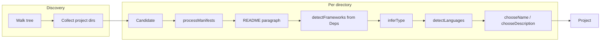

# Agent specification: `detector` package

This document describes the **project detection** subsystem so agents can safely extend, debug, or refactor it without rediscovering structure from scratch.

## Purpose

The package walks a filesystem tree under a **root** directory, finds directories that look like **standalone projects** (via manifest files), and returns JSON-friendly **`Project`** values: human-readable name, description, inferred type, languages, frameworks, confidence, and provenance **sources**.

It is **heuristic**, not a build system: parsing is intentionally shallow (regex, simple line scans, partial TOML trees).

---

## Public API

| Symbol | Role |
|--------|------|
| `Detect(root string, maxFiles int) ([]Project, error)` | Main entry: discovers project directories, builds `Candidate`s, returns sorted `Project` slice. |
| `Project` | Output DTO: `Name`, `Description`, `Type`, `Languages`, `Frameworks`, `Path` (relative to `root`), `Confidence`, `Sources`. |

There are no other exported identifiers intended for external callers; everything else is `package` internal.

---

## End-to-end pipeline

1. **`discoverProjectDirs(root)`** — `filepath.WalkDir`; records a directory when it sees a known manifest filename or `*.csproj`. Skips `ignoreDirs` (e.g. `node_modules`, `.git`).
2. For each directory, a **`Candidate`** is filled:
   - **`processManifests`** — runs processors for files **present in that directory** (exact basename match), then Terraform/OpenAPI heuristics.
   - **`readReadmeParagraph`** — optional description from first meaningful README paragraph.
   - **`detectFrameworks(c.Deps)`** — maps normalized dependency names to framework labels.
   - **`inferType(c)`** — scores `TypeHints`, flags, frameworks; picks highest-scoring type or `"application"`.
   - **`detectLanguages(dir, maxFiles)`** — extension counts, top 3 languages by file count (walk capped by `maxFiles`).
   - **`chooseName` / `chooseDescription`** — name from manifest candidates; description from weighted `DescCands` or **`synthesizeDescription`**.

Results are **sorted by `Path`** for stable output.

---

## Source files (responsibilities)

| File | Responsibility |
|------|----------------|
| `detector.go` | `Project`, discovery, `fileSetProcessors`, manifest processors for Composer/Chart/Serverless/Pulumi, `detectLanguages`, `detectFrameworks`, `inferType`, `chooseName`, `chooseDescription`, `synthesizeDescription`, `inferDomainFromPath`, Terraform/OpenAPI walks, helpers (`normName`, `dedupStrings`, `contains`, …). |
| `candidate.go` | `Candidate`, `descCandidate`, **`addDesc`** (deduplicates identical text, appends source). |
| `unmarshallers.go` | `readJSONFile`, `readTOMLFile`, `readYAMLFile`. |
| `markdown.go` | README discovery, first-paragraph extraction, light markdown strip. |
| `lang_javascript.go` | `package.json` → names, description, deps, frontend type hints. |
| `lang_python.go` | `pyproject.toml` (PEP 621 + Poetry), `requirements.txt`, `normReqName`, `getSlice`. |
| `lang_go.go` | `go.mod` parsing (module line + coarse require/deps). |
| `lang_rust.go` | `Cargo.toml` package + dependencies. |
| `lang_java.go` | `pom.xml`, `build.gradle` / `build.gradle.kts` (regex description + coarse Gradle deps). |
| `lang_dotnet.go` | **`processCsprojIfAny`** — scans directory for `*.csproj`. |

Constants like `packageJSON` / `pyprojectToml` live next to their processors and are reused in `manifestNames` / `fileSetProcessors` in `detector.go`.

---

## `Candidate` model (invariants agents should preserve)

- **`Dir`** — absolute or root-relative path being analyzed; processors join filenames under it.
- **`Names`** — candidate project names from manifests (order matters for `chooseName`: first usable wins after slash handling).
- **`DescCands`** — `{Text, Weight, Source}`; **`addDesc`** skips duplicate **text** and mirrors **source** into **`Sources`**.
- **`Deps`** — normalized lowercase-ish names (see `normName`, `normReqName`); used only for **framework** detection, not for exact version resolution.
- **`TypeHints`** — string keys (`infra`, `api`, `web-frontend`, `function`, `application`, …) with integer scores consumed by **`inferType`**.
- **`Sources`** — provenance strings for descriptions and manifests (can duplicate; **`dedupStrings`** on final `Project`).

---

## Adding a new manifest processor

1. Implement **`func processX(c *Candidate)`** in an appropriate `lang_*.go` file (or `detector.go` if shared YAML/JSON structs stay there).
2. Add the **exact basename** to **`manifestNames`** in `detector.go` so `discoverProjectDirs` marks the folder as a project.
3. Register in **`fileSetProcessors`** with the **same basename** as the key.
4. Use **`readJSONFile` / `readTOMLFile` / `readYAMLFile`** from `unmarshallers.go` when applicable.
5. Populate **`c.Names`**, **`c.addDesc`**, **`c.Deps`**, **`c.TypeHints`**, and **`c.Sources`** consistently with existing processors.

**Naming:** dependency keys should go through **`normName`** (or `normReqName` for pip-style lines) so **`detectFrameworks`** can match.

---

## Inferred `Type` values

Common return values from **`inferType`** (non-exhaustive): `"api"`, `"web-frontend"`, `"cli"`, `"infra"`, `"function"`, **`"application"`** (default fallback). These feed **English** phrases in **`synthesizeDescription`** — keep user-facing strings in English unless product requirements change.

---

## Known wiring caveat: `.csproj`

- **`discoverProjectDirs`** treats any `*.csproj` as marking a project directory.
- **`fileSetProcessors`** registers **`"csproj"`** → `processCsprojIfAny`, but **`processManifests`** only runs processors when a file’s **basename** equals the map key. Real files are named `Something.csproj`, not `csproj`.
- **`processCsprojIfAny`** itself scans the directory for `*.csproj` and does not need the map entry to *function* — but as written, it is **never invoked** from `processManifests`. Fixing this belongs in **`processManifests`** (e.g. call `processCsprojIfAny` when any `*.csproj` exists) or by matching suffixes — agents should verify behavior with a small fixture before relying on .NET metadata in output.

---

## Performance and limits

- **`maxFiles`** caps the language-detection walk per project; hitting the cap can stop early (`io.EOF` from walk).
- Large READMEs: first-paragraph logic bails if an internal buffer exceeds ~2000 runes while scanning lines.

---

## Dependencies (external)

- `github.com/guionardo/gs-dev/pkg/tools/files` — **`FindFirst`** for manifests that may need path search.
- `github.com/BurntSushi/toml`, `gopkg.in/yaml.v3`, `golang.org/x/text` (case/language for synthesized text).

---

## Style expectations for changes

- Keep **one package** (`detector`); no subpackages for a single new file unless the codebase moves that way elsewhere.
- Prefer **small, focused** helpers over duplicating normalization logic.
- **Comments and user-visible synthesized strings** should be **English** (see existing `detector.go` / `synthesizeDescription`).
- Run **`go build ./internal/project_detect/...`** (or full module tests) after edits.
